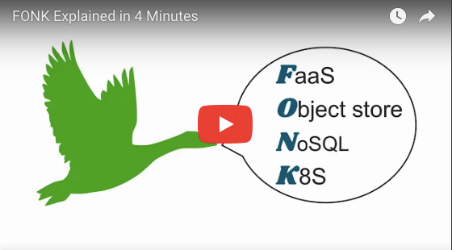

# fonk-apps.io examples
Welcome to the fonk-apps.io examples repo!

How can you get started?

First, [deploy a FONK environment](deploy.md).  Then, clone this repo and try out one of the example variants to see how little code it takes to get started with this simple web app design pattern.

See an example/FaaS runtime/language combination that's missing?  Join in the fun!

We are currently accepting Pull Requests for [Guestbook](/guestbook) on all FaaS runtimes and for a variety of languages.  Take a look at an existing example and riff off of it to complete a missing combination.  Be sure to take a look at our [Contribution Guide](CONTRIBUTING.md) before submitting a PR.
