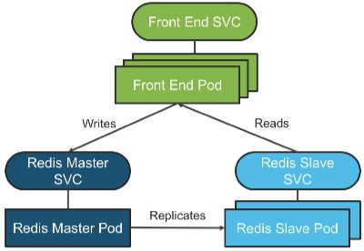
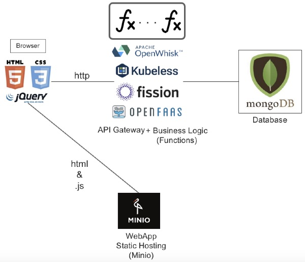

# fonk-apps.io Guestbook
[Guestbook](https://github.com/kubernetes/examples/tree/master/guestbook) is in many ways the 'hello world' of the K8S community and makes for a good first FONK example because it is so familiar to people.  The architecture of the K8S Guestbook is as follows:

By default, three pods get deployed to handle front end traffic, two for database reads, and one for database writes.

A FONK approach to Guestbook uses the following components:

Files for this set of examples follows this structure with the front end HTML, .js, and Minio start up/configuration instructions in the `frontend` folder.  No additional configuration is required of the Mongo database beyond what you have already done during FONK deployment.  

Guestbook has two basic operations: Create and List.  Upon initial page load, the JavaScript in the `frontend` makes a REST API call to get the list of entries already in the database.  When a user enters a new message in the UI, the `frontend` makes a REST API call to create a new entry before then making a second call to get the list of entries now in the database.

Each FaaS runtime/language combination implements Create and List, so start there.  Then follow the instructions in `frontend` to put a UI on top of the Create and List REST API calls you created with the FaaS runtime/language combination you chose.

See a missing combination?  Feel free to contribute by submitting a Pull Request with your implementation of that combination so that others can learn from your experience!
